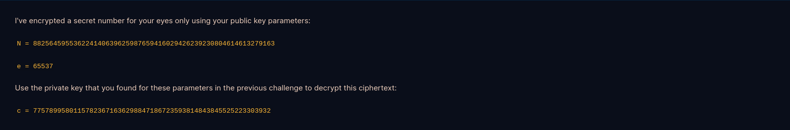

# RSA

## Starter

### RSA Starter 1


Bài này mình cần tính $101^{17} \mod 22663$. Đoạn code đơn giản sau sẽ thực hiện điều đó:

```py
print(pow(101, 17, 22663))
```

Flag:

```
19906
```

### RSA Starter 2


Đề yêu cầu mình mã hóa số $12$ bằng RSA với $e = 65537$ và $p = 17$, $q = 23$:

```py
e = 65537
p = 17
q = 23
m = 12  # giá trị cần mã hóa

N = p * q  # tính modulus
c = pow(m, e, N)  # mã hóa m theo RSA (c = m ** d mod N)

print(c)
```

Flag:

```
301
```

### RSA Starter 3


Mình cần phải tính phi hàm Euler của $N$. Có một cách đơn giản để tính phi hàm của một số $N$ là phân tích $N$ thành thừa số nguyên tố và lấy phi hàm của từng số nguyên tố đó nhân lại với nhau:

```
n = a * b * c * ... (a, b, c, ... là số nguyên tố)
phi(n) = phi(a) * phi(b) * phi(c) * phi... 
phi(x) = x - 1 (nếu x là số nguyên tố)
```

Ta có $N = p * q$ mà $p$ và $q$ là 2 số nguyên tố, suy ra $phi(N) = phi(p) * phi(q) = (p - 1) * (q - 1)$

```py
p = 857504083339712752489993810777
q = 1029224947942998075080348647219
phi = (p - 1) * (q - 1)
print(phi)
```

Flag:

```
882564595536224140639625987657529300394956519977044270821168
```

### RSA Starter 4


Dựa theo đề, ta biết khóa bí mật $d$ được tính bằng nghịch đảo của $e$ theo modulo là phi hàm Euler của $N$:

```py
p = 857504083339712752489993810777
q = 1029224947942998075080348647219
e = 65537

phi = (p - 1) * (q - 1)
d = pow(e, -1, phi)

print(d)
```

Flag:

```
121832886702415731577073962957377780195510499965398469843281
```

### RSA Starter 5



Sử dụng khóa bí mật $d$ của bài trước, mình giải mã được `c`:

```py
N = 882564595536224140639625987659416029426239230804614613279163
e = 65537
c = 77578995801157823671636298847186723593814843845525223303932 
d = 121832886702415731577073962957377780195510499965398469843281
m = pow(c, d, N)
print(m)
```

Flag:

```
13371337
```

### RSA Starter 6


Đề yêu cầu mình tính mã băm SHA256 của flag sau đó mã hóa bằng RSA với $N$ và $d$ được cung cấp ở trong file `private.key`. Ở đây mình dùng hàm băm SHA256 thuộc thư viện `hashlib`.

```py
import hashlib

N = 15216583654836731327639981224133918855895948374072384050848479908982286890731769486609085918857664046075375253168955058743185664390273058074450390236774324903305663479046566232967297765731625328029814055635316002591227570271271445226094919864475407884459980489638001092788574811554149774028950310695112688723853763743238753349782508121985338746755237819373178699343135091783992299561827389745132880022259873387524273298850340648779897909381979714026837172003953221052431217940632552930880000919436507245150726543040714721553361063311954285289857582079880295199632757829525723874753306371990452491305564061051059885803
d = 11175901210643014262548222473449533091378848269490518850474399681690547281665059317155831692300453197335735728459259392366823302405685389586883670043744683993709123180805154631088513521456979317628012721881537154107239389466063136007337120599915456659758559300673444689263854921332185562706707573660658164991098457874495054854491474065039621922972671588299315846306069845169959451250821044417886630346229021305410340100401530146135418806544340908355106582089082980533651095594192031411679866134256418292249592135441145384466261279428795408721990564658703903787956958168449841491667690491585550160457893350536334242689

m = hashlib.sha256(b'crypto{Immut4ble_m3ssag1ng}').hexdigest()
S = pow(int(m, 16), d, N)

print(hex(S)[2:])
```

Flag:

```
6ac9bb8f110b318a40ad8d7e57defdcce2652f5928b5f9b97c1504d7096d7af1d34e477b30f1a08014e8d525b14458b709a77a5fa67d4711bd19da1446f9fb0ffd9fdedc4101bdc9a4b26dd036f11d02f6b56f4926170c643f302d59c4fe8ea678b3ca91b4bb9b2024f2a839bec1514c0242b57e1f5e77999ee67c450982730252bc2c3c35acb4ac06a6ce8b9dbf84e29df0baa7369e0fd26f6dfcfb22a464e05c5b72baba8f78dc742e96542169710918ee2947749477869cb3567180ccbdfe6fdbe85bcaca4bf6da77c8f382bb4c8cd56dee43d1290ca856318c97f1756b789e3cac0c9738f5e9f797314d39a2ededb92583d97124ec6b313c4ea3464037d3
```

## Primes Part 1

### Factoring


Mình cần phải phân tích số 150-bit thành thừa số nguyên tố và flag chính là số nhỏ hơn. Bài này mình sử dụng [factordb.com](http://factordb.com) để phân tích.


Flag:

```
19704762736204164635843
```

### Inferius Prime

Do $N$ ở đây không quá lớn, mình sẽ dùng factordb để phân tích $N$ ra thành $p$ và $q$ và tính khóa bí mật.

```py
from Crypto.Util.number import inverse, long_to_bytes

N = 742449129124467073921545687640895127535705902454369756401331
e = 3
ct = 39207274348578481322317340648475596807303160111338236677373

p = 752708788837165590355094155871
q = 986369682585281993933185289261

phi = (p - 1) * (q - 1)
d = inverse(e, phi)
m = pow(ct, d, N)

print(long_to_bytes(m))
```

Flag:

```
crypto{N33d_b1g_pR1m35}
```

### Monoprime


Vì đề chỉ sử dụng một số nguyên tố là $p$ do đó $p = N$, ta có ngay $phi = N - 1$.

```py
from Crypto.Util.number import inverse, long_to_bytes

N = 171731371218065444125482536302245915415603318380280392385291836472299752747934607246477508507827284075763910264995326010251268493630501989810855418416643352631102434317900028697993224868629935657273062472544675693365930943308086634291936846505861203914449338007760990051788980485462592823446469606824421932591
e = 65537
ct = 161367550346730604451454756189028938964941280347662098798775466019463375610700074840105776873791605070092554650190486030367121011578171525759600774739890458414593857709994072516290998135846956596662071379067305011746842247628316996977338024343628757374524136260758515864509435302781735938531030576289086798942

phi = N - 1
d = inverse(e, phi)
m = pow(ct, d, N)

print(long_to_bytes(m))
```

Flag:

```
crypto{0n3_pr1m3_41n7_pr1m3_l0l}
```

### Square Eyes


Đề sử dụng 1 số nguyên tố cho cả $p$ và $q$ do đó $p = q$. Ta có: $ N = p * p => sqrt(N) = p$. Theo công thức tính phi hàm Euler nếu:


Trong đó các $p_i$ là các số nguyên tố phân biệt, thì 


Do đó ta có $phi(N) = (p - 1) * p$

```py
from Crypto.Util.number import inverse, long_to_bytes
import math

N = 535860808044009550029177135708168016201451343147313565371014459027743491739422885443084705720731409713775527993719682583669164873806842043288439828071789970694759080842162253955259590552283047728782812946845160334801782088068154453021936721710269050985805054692096738777321796153384024897615594493453068138341203673749514094546000253631902991617197847584519694152122765406982133526594928685232381934742152195861380221224370858128736975959176861651044370378539093990198336298572944512738570839396588590096813217791191895941380464803377602779240663133834952329316862399581950590588006371221334128215409197603236942597674756728212232134056562716399155080108881105952768189193728827484667349378091100068224404684701674782399200373192433062767622841264055426035349769018117299620554803902490432339600566432246795818167460916180647394169157647245603555692735630862148715428791242764799469896924753470539857080767170052783918273180304835318388177089674231640910337743789750979216202573226794240332797892868276309400253925932223895530714169648116569013581643192341931800785254715083294526325980247219218364118877864892068185905587410977152737936310734712276956663192182487672474651103240004173381041237906849437490609652395748868434296753449
e = 65537
c = 222502885974182429500948389840563415291534726891354573907329512556439632810921927905220486727807436668035929302442754225952786602492250448020341217733646472982286222338860566076161977786095675944552232391481278782019346283900959677167026636830252067048759720251671811058647569724495547940966885025629807079171218371644528053562232396674283745310132242492367274184667845174514466834132589971388067076980563188513333661165819462428837210575342101036356974189393390097403614434491507672459254969638032776897417674577487775755539964915035731988499983726435005007850876000232292458554577437739427313453671492956668188219600633325930981748162455965093222648173134777571527681591366164711307355510889316052064146089646772869610726671696699221157985834325663661400034831442431209123478778078255846830522226390964119818784903330200488705212765569163495571851459355520398928214206285080883954881888668509262455490889283862560453598662919522224935145694435885396500780651530829377030371611921181207362217397805303962112100190783763061909945889717878397740711340114311597934724670601992737526668932871436226135393872881664511222789565256059138002651403875484920711316522536260604255269532161594824301047729082877262812899724246757871448545439896

p = math.isqrt(N)
phi = (p - 1) * p
d = inverse(e, phi)
m = pow(c, d, N)

print(long_to_bytes(m))
```

Flag:

```
crypto{squar3_r00t_i5_f4st3r_th4n_f4ct0r1ng!}
```

### Manyprime


Vì $N$ được tạo từ nhiều số nguyên tố nên các số nguyên tố tạo thành sẽ có kích thước nhỏ, vì vậy mình các thuật toán như [Pollard's rho](https://en.wikipedia.org/wiki/Pollard%27s_rho_algorithm),.. để phân tích $N$. Ở đây mình dùng factordb trong python thông qua thư viện `factordb-pycli`.

```py
from Crypto.Util.number import inverse, long_to_bytes
from factordb.factordb import FactorDB

N = 580642391898843192929563856870897799650883152718761762932292482252152591279871421569162037190419036435041797739880389529593674485555792234900969402019055601781662044515999210032698275981631376651117318677368742867687180140048715627160641771118040372573575479330830092989800730105573700557717146251860588802509310534792310748898504394966263819959963273509119791037525504422606634640173277598774814099540555569257179715908642917355365791447508751401889724095964924513196281345665480688029639999472649549163147599540142367575413885729653166517595719991872223011969856259344396899748662101941230745601719730556631637
e = 65537
ct = 320721490534624434149993723527322977960556510750628354856260732098109692581338409999983376131354918370047625150454728718467998870322344980985635149656977787964380651868131740312053755501594999166365821315043312308622388016666802478485476059625888033017198083472976011719998333985531756978678758897472845358167730221506573817798467100023754709109274265835201757369829744113233607359526441007577850111228850004361838028842815813724076511058179239339760639518034583306154826603816927757236549096339501503316601078891287408682099750164720032975016814187899399273719181407940397071512493967454225665490162619270814464

factors = FactorDB(N)
factors.connect()
factors = factors.get_factor_list()

phi = 1
for p  in factors:
	phi *= (p - 1)

d = inverse(e, phi)
m = pow(ct, d, N)

print(long_to_bytes(m))
```

Flag:

```
crypto{700_m4ny_5m4ll_f4c70r5}
```

## Public exponent

### Salty


Vì modulus $N$ ở đâ lớn hơn $c$ rất nhiều và có lũy thừa $e$ bằng $1$ suy ra phép modulo không được sử dụng, vì vậy chỉ cần chuyển $c$ về text là tìm ra được flag:

```py
from Crypto.Util.number import inverse, long_to_bytes

ct = 44981230718212183604274785925793145442655465025264554046028251311164494127485
print(long_to_bytes(ct))
```

Flag:

```
crypto{saltstack_fell_for_this!}
```

### Modulus Inutilis


Tương tự như bài trước, ở đây $e = 3$ quá nhỏ không đủ để phép modulo được sử dụng, mình cần tình căn bậc $e$ để tìm lại flag.

```py
from Crypto.Util.number import inverse, long_to_bytes
import gmpy2

e = 3
ct = 243251053617903760309941844835411292373350655973075480264001352919865180151222189820473358411037759381328642957324889519192337152355302808400638052620580409813222660643570085177957
m = gmpy2.iroot(ct, e)

print(long_to_bytes(m[0]))
```

Flag:

```
crypto{N33d_m04R_p4dd1ng}
```

### Everything is Big


Với một hệ RSA mà $N$, $e$ và $c$ đều lớn thì $d$ sẽ nhỏ, ta có thể dự đoán ra giá trị xấp xỉ của $d$ dựa vào liên phân số. Đây cũng là ý tưởng chính của [Wiener's RSA Attack](https://sagi.io/crypto-classics-wieners-rsa-attack/).

```py
from Crypto.Util.number import long_to_bytes
import gmpy2

def cf_expansion(n, d):
    e = []

    q = n // d
    r = n % d
    e.append(q)
    
    while r:
        n, d = d, r
        q = n // d
        r = n % d
        e.append(q)       
    
    return e

def cf_convergents(e):
    n = []
    d = []
    
    for i in range(len(e)):
        if i == 0:
            n.append(e[i])
            d.append(1)
        elif i == 1:
            n.append(e[i]*e[i - 1] + 1)
            d.append(e[i])
        else:
            n.append(e[i]*n[i - 1] + n[i - 2])
            d.append(e[i]*d[i - 1] + d[i - 2])

        yield (n[-1], d[-1])

def int_quadratic_solve(a, b, c):
    roots = []

    d = b*b - 4*a*c
    if d < 0:
        return roots
    
    sqrt_d, is_square = gmpy2.iroot(d, 2)
    
    if not is_square:
        return roots

    if (-b + sqrt_d) % (2 * a) == 0:
        roots.append((-b + sqrt_d) // (2 * a))

    if (-b - sqrt_d) % (2 * a) == 0:
        roots.append((-b - sqrt_d) // (2 * a))

    return roots

def wiener_attack(e, N):
    expansion = cf_expansion(e, N)
    convergents = cf_convergents(expansion)

    for k, d in convergents:
        if k == 0 or (e*d - 1) % k:
            continue


        phi = (e*d - 1) // k
        roots = int_quadratic_solve(1, phi - N - 1, N)

        if len(roots) == 2 and roots[0] * roots[1] == N:
            return d

    return None

N = 0xb8af3d3afb893a602de4afe2a29d7615075d1e570f8bad8ebbe9b5b9076594cf06b6e7b30905b6420e950043380ea746f0a14dae34469aa723e946e484a58bcd92d1039105871ffd63ffe64534b7d7f8d84b4a569723f7a833e6daf5e182d658655f739a4e37bd9f4a44aff6ca0255cda5313c3048f56eed5b21dc8d88bf5a8f8379eac83d8523e484fa6ae8dbcb239e65d3777829a6903d779cd2498b255fcf275e5f49471f35992435ee7cade98c8e82a8beb5ce1749349caa16759afc4e799edb12d299374d748a9e3c82e1cc983cdf9daec0a2739dadcc0982c1e7e492139cbff18c5d44529407edfd8e75743d2f51ce2b58573fea6fbd4fe25154b9964d
e = 0x9ab58dbc8049b574c361573955f08ea69f97ecf37400f9626d8f5ac55ca087165ce5e1f459ef6fa5f158cc8e75cb400a7473e89dd38922ead221b33bc33d6d716fb0e4e127b0fc18a197daf856a7062b49fba7a86e3a138956af04f481b7a7d481994aeebc2672e500f3f6d8c581268c2cfad4845158f79c2ef28f242f4fa8f6e573b8723a752d96169c9d885ada59cdeb6dbe932de86a019a7e8fc8aeb07748cfb272bd36d94fe83351252187c2e0bc58bb7a0a0af154b63397e6c68af4314601e29b07caed301b6831cf34caa579eb42a8c8bf69898d04b495174b5d7de0f20cf2b8fc55ed35c6ad157d3e7009f16d6b61786ee40583850e67af13e9d25be3
c = 0x3f984ff5244f1836ed69361f29905ca1ae6b3dcf249133c398d7762f5e277919174694293989144c9d25e940d2f66058b2289c75d1b8d0729f9a7c4564404a5fd4313675f85f31b47156068878e236c5635156b0fa21e24346c2041ae42423078577a1413f41375a4d49296ab17910ae214b45155c4570f95ca874ccae9fa80433a1ab453cbb28d780c2f1f4dc7071c93aff3924d76c5b4068a0371dff82531313f281a8acadaa2bd5078d3ddcefcb981f37ff9b8b14c7d9bf1accffe7857160982a2c7d9ee01d3e82265eec9c7401ecc7f02581fd0d912684f42d1b71df87a1ca51515aab4e58fab4da96e154ea6cdfb573a71d81b2ea4a080a1066e1bc3474

d = wiener_attack(e, N)
m = pow(c, d, N)

print(long_to_bytes(m))
```

Flag:

```
crypto{s0m3th1ng5_c4n_b3_t00_b1g}
```