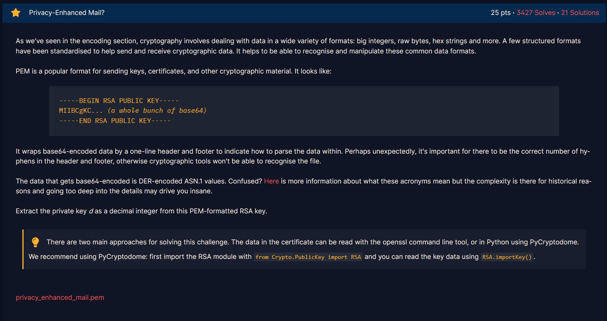
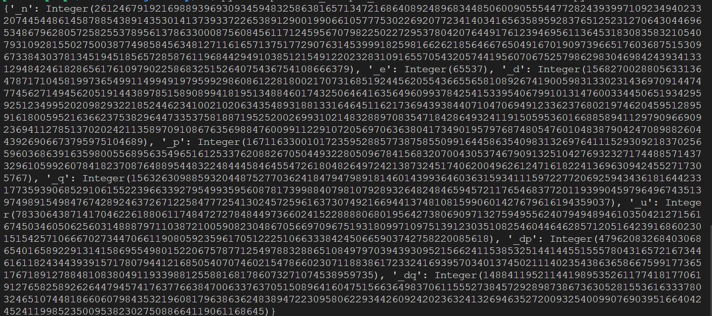
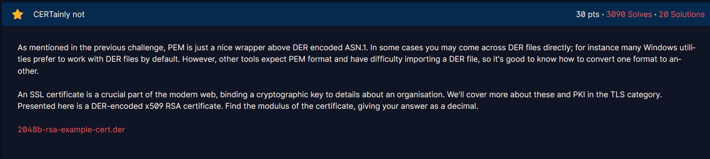
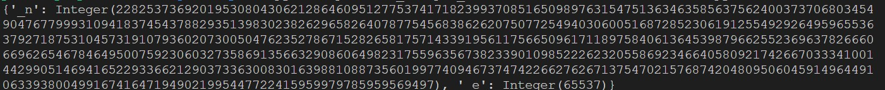
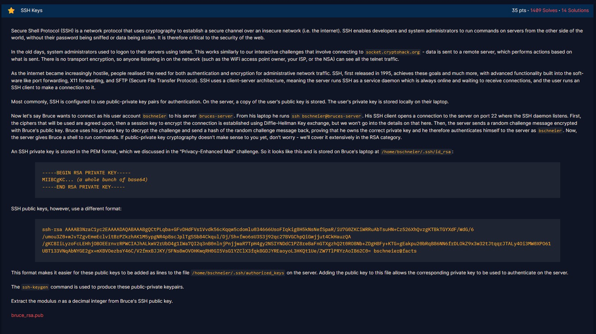
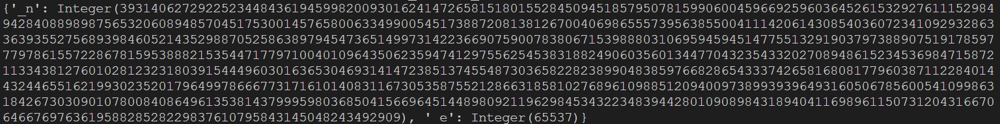

# Privacy-Enhanced Mail?



Đối với bài này ta chỉ cần tải file PEM về rồi làm theo hướng dẫn của bài: sử dụng hàm `RSA.importKey()` của `from Crypto.PublicKey import RSA` để đọc.

```python
from Crypto.PublicKey import RSA

f = open('privacy_enhanced_mail_1f696c053d76a78c2c531bb013a92d4a.pem','r')
key = RSA.importKey(f.read())
print(vars(key))
```

Sử dụng lệnh `vars` trong python để lấy các thuộc tính của key. 



Flag chính là thuộc tính `_d` như đề bài yêu cầu:

```
15682700288056331364787171045819973654991149949197959929860861228180021707316851924456205543665565810892674190059831330231436970914474774562714945620519144389785158908994181951348846017432506464163564960993784254153395406799101314760033445065193429592512349952020982932218524462341002102063435489318813316464511621736943938440710470694912336237680219746204595128959161800595216366237538296447335375818871952520026993102148328897083547184286493241191505953601668858941129790966909236941127851370202421135897091086763569884760099112291072056970636380417349019579768748054760104838790424708988260443926906673795975104689
```

# CERTainly not

Bài này tương tự như bài trên nhưng lần này là file key ở định dạng khác (DER-encoded x509 RSA certificate).



Hàm `importKey()` cũng có hỗ trợ định dành này, khác ở chỗ là ta cần đọc bytes (đổi `'r'` thành `'rb'`).

```python
from Crypto.PublicKey import RSA

f = open('2048b-rsa-example-cert_3220bd92e30015fe4fbeb84a755e7ca5.der','rb')
key = RSA.importKey(f.read())
print(vars(key))
```



Flag chính là thuộc tính `_n` như đề bài yêu cầu:
```
22825373692019530804306212864609512775374171823993708516509897631547513634635856375624003737068034549047677999310941837454378829351398302382629658264078775456838626207507725494030600516872852306191255492926495965536379271875310457319107936020730050476235278671528265817571433919561175665096171189758406136453987966255236963782666066962654678464950075923060327358691356632908606498231755963567382339010985222623205586923466405809217426670333410014429905146941652293366212903733630083016398810887356019977409467374742266276267137547021576874204809506045914964491063393800499167416471949021995447722415959979785959569497
```

# SSH Keys


Phần mô tả chủ yếu giới thiệu về SSH. Phần challenge đưa ra format của file SSH public keys và yêu cầu ta trích dữ liệu về số modulus `n`:

```python
from Crypto.PublicKey import RSA

f = open('bruce_rsa_6e7ecd53b443a97013397b1a1ea30e14.pub','r')
key = RSA.importKey(f.read())
print(vars(key))
```



Flag chính là trường `_n`:
```
3931406272922523448436194599820093016241472658151801552845094518579507815990600459669259603645261532927611152984942840889898756532060894857045175300145765800633499005451738872081381267004069865557395638550041114206143085403607234109293286336393552756893984605214352988705258638979454736514997314223669075900783806715398880310695945945147755132919037973889075191785977797861557228678159538882153544717797100401096435062359474129755625453831882490603560134477043235433202708948615234536984715872113343812760102812323180391544496030163653046931414723851374554873036582282389904838597668286543337426581680817796038711228401443244655162199302352017964997866677317161014083116730535875521286631858102768961098851209400973899393964931605067856005410998631842673030901078008408649613538143799959803685041566964514489809211962984534322348394428010908984318940411698961150731204316670646676976361958828528229837610795843145048243492909
```

# Transparency