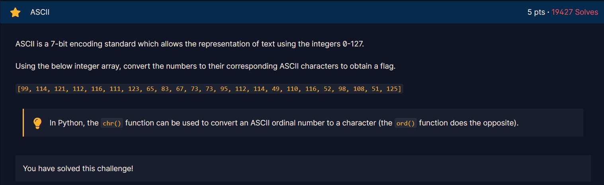
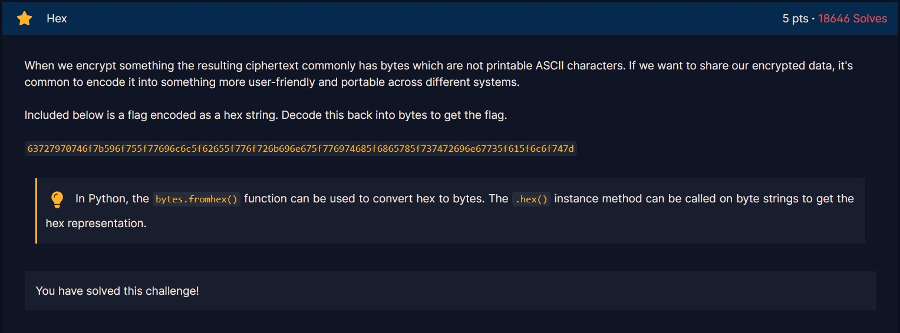
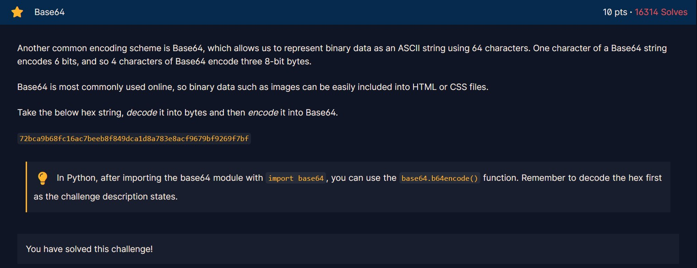
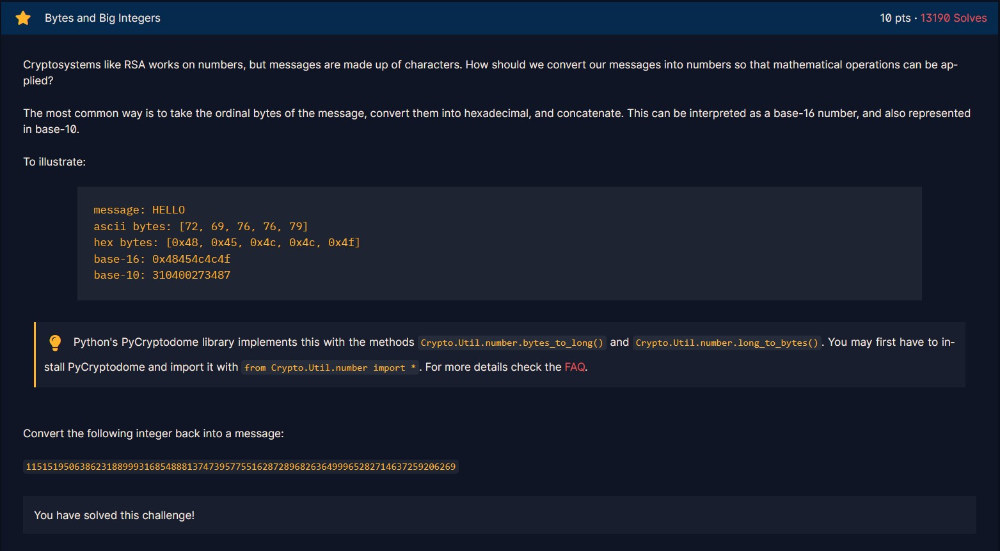
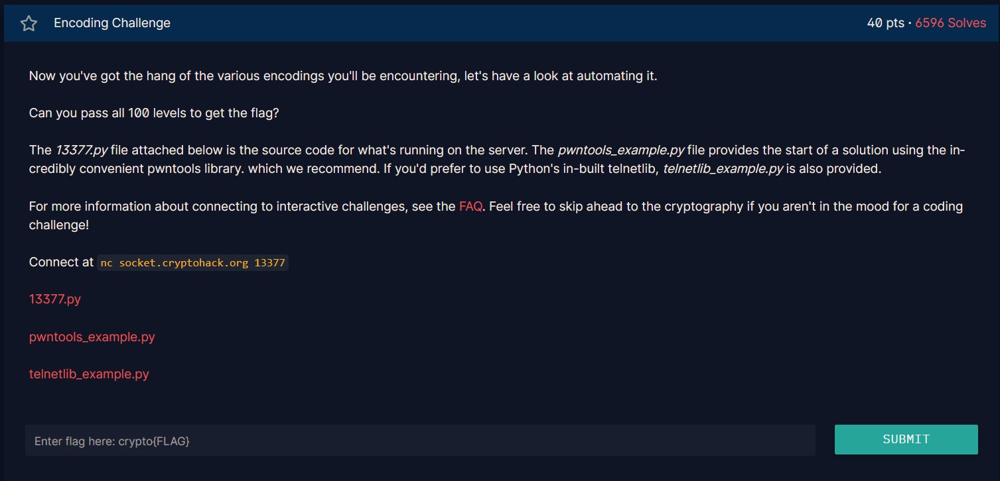

# ASCII



Phần mô tả giới thiệu về mã ASCII.

Ta cần mảng những mã ASCII về kiểu kí tự.

Đề bài gợi ý sử dụng hàm `chr()`:

```py
print(''.join([chr(i) for i in [99, 114, 121, 112, 116, 111, 123, 65, 83, 67, 73, 73, 95, 112, 114, 49, 110, 116, 52, 98, 108, 51, 125]]))
```

Flag:
```
crypto{ASCII_pr1nt4bl3}
```

# Hex



Đề bài giới thiệu cho ta về chuỗi hex và bytes. Ta sẽ đưa chuỗi hex của đề bài về dạng bytes.

Ta sử dụng hàm `bytes.fromhex()`:

```py
print(bytes.fromhex("63727970746f7b596f755f77696c6c5f62655f776f726b696e675f776974685f6865785f737472696e67735f615f6c6f747d"))
```

Và nhận được flag:

```
b'crypto{You_will_be_working_with_hex_strings_a_lot}'
```

# Base64



Tới đây ta được làm quen với base64. 

Đề bài cho ta một chuỗi hex và yêu cầu ta đưa về dạng bytes rồi dùng hàm `base64.b64encode()` để encode chuỗi bytes.

```py
import base64

t = "72bca9b68fc16ac7beeb8f849dca1d8a783e8acf9679bf9269f7bf"
print(base64.b64encode(bytes.fromhex(t)))
```

Và nhận được:

```
b'crypto/Base+64+Encoding+is+Web+Safe/'
```

Trước khi nộp nhớ đưa về đúng định dạng flag nhé :)

# Bytes and Big Integers



Với bài này thì ta được cho số ở dạng base-10, ta sẽ sử dụng hàm `Crypto.Util.number.long_to_bytes()` để chuyển sang bytes.

```py
from Crypto.Util.number import *

print(long_to_bytes(11515195063862318899931685488813747395775516287289682636499965282714637259206269))
```

Flag:

```
b'crypto{3nc0d1n6_4ll_7h3_w4y_d0wn}'
```

# Encoding Challenge



Chúng ta cần giải 100 level để lấy được flag. Mỗi level yêu cầu chúng ta nhận một đoạn mã bằng netcat dưới dạng json và decode nó ra rồi gửi nó về server.

**1337.py**
```py
#!/usr/bin/env python3

from Crypto.Util.number import bytes_to_long, long_to_bytes
from utils import listener # this is cryptohack's server-side module and not part of python
import base64
import codecs
import random

FLAG = "crypto{????????????????????}"
ENCODINGS = [
    "base64",
    "hex",
    "rot13",
    "bigint",
    "utf-8",
]
with open('/usr/share/dict/words') as f:
    WORDS = [line.strip().replace("'", "") for line in f.readlines()]


class Challenge():
    def __init__(self):
        self.challenge_words = ""
        self.stage = 0

    def create_level(self):
        self.stage += 1
        self.challenge_words = "_".join(random.choices(WORDS, k=3))
        encoding = random.choice(ENCODINGS)

        if encoding == "base64":
            encoded = base64.b64encode(self.challenge_words.encode()).decode() # wow so encode
        elif encoding == "hex":
            encoded = self.challenge_words.encode().hex()
        elif encoding == "rot13":
            encoded = codecs.encode(self.challenge_words, 'rot_13')
        elif encoding == "bigint":
            encoded = hex(bytes_to_long(self.challenge_words.encode()))
        elif encoding == "utf-8":
            encoded = [ord(b) for b in self.challenge_words]

        return {"type": encoding, "encoded": encoded}

    #
    # This challenge function is called on your input, which must be JSON
    # encoded
    #
    def challenge(self, your_input):
        if self.stage == 0:
            return self.create_level()
        elif self.stage == 100:
            self.exit = True
            return {"flag": FLAG}

        if self.challenge_words == your_input["decoded"]:
            return self.create_level()

        return {"error": "Decoding fail"}


listener.start_server(port=13377)
```

Từ file `1337.py` ta biết được có 5 cách encode (bao gồm base64, hex, rot13, utf-8 và bigint) có dạng json như sau:
```json
{
    "type": "base64",
    "encoded": "ZXZhbHVhdGVkX2JhZF9uZXZlcnRoZWxlc3M="
}
```

Ta cần decode trường `encoded` rồi gửi về server một json có dạng:
```json
{
    "decoded": "evaluated_bad_nevertheless"
}
```

Vì có tới 100 level nên ta phải lập trình để giải:
```py
from pwn import *
import json
import codecs
from Crypto.Util.number import bytes_to_long, long_to_bytes

conn = remote('socket.cryptohack.org', 13377)#, level = 'debug')
turn = 0
while (True):
    turn += 1
    print(turn)
    t = conn.recvline().decode()
    print(t)
    
    j = json.loads(t)

    ans = ""
    if (j["type"] == "rot13"):
        ans = codecs.decode(j["encoded"], 'rot_13')
    elif (j["type"] == "base64"):
        ans = base64.b64decode(j["encoded"]).decode()
    elif (j["type"] == "utf-8"):
        for x in j["encoded"]:
            ans += chr(x)
    elif (j["type"] == "bigint"):
        ans = long_to_bytes(int(j["encoded"], 16)).decode()
    elif (j["type"] == "hex"):
        for i in range(0, len(j["encoded"]), 2):
            ans += chr(int(j["encoded"][i:i + 2], 16))
    else:
        exit(0)

    print(ans)
    request = json.dumps({'decoded': f"{ans}"}).encode()
    print(request)
    conn.sendline(request)
```

Ta nhận được json chứa flag:

```json
{
    "flag": "crypto{3nc0d3_d3c0d3_3nc0d3}"
}
```