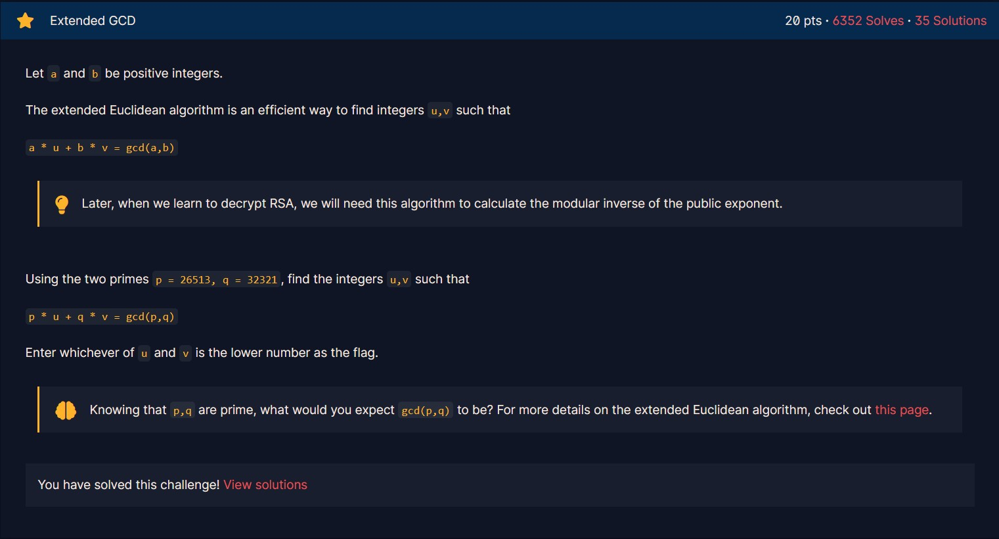

# Greatest Common Divisor


Phần mô tả giới thiệu về ước số chung lớn nhất mà ta đã được học ở lớp 6. Có một phương pháp là sử dụng [thuật toán Euclid](https://en.wikipedia.org/wiki/Euclidean_algorithm) để tìm ước chung lớn nhất của 2 số nguyên một cách nhanh chóng.

C++ cung cấp hàm `__gcd()` bản chất là sử dụng [thuật toán Euclid](https://en.wikipedia.org/wiki/Euclidean_algorithm).
```cpp
#include <bits/stdc++.h>

using namespace std;

int main()
{
    if (fopen("test.inp", "r"))
        freopen("test.inp", "r", stdin);
    
    cout << __gcd(66528, 52920);
    return 0;
}

```

Kết quả:
```
1512
```

# Extended GCD



Bên cạnh [thuật toán Euclid](https://en.wikipedia.org/wiki/Euclidean_algorithm) còn có thuật [toán Euclid mở rộng](https://en.wikipedia.org/wiki/Extended_Euclidean_algorithm). Đó là một thuật toán để tìm cặp số `(u, v)` thỏa mãn `a * u + b * v = gcd(a, b)` với `a`, `b` cho trước.

Cách thuật toán hoạt động mình sẽ không trình bày ở đây.

Đề bài yêu cầu tìm cặp số `(u, v)` thỏa mãn `26513 * u + 32321 * v = gcd(26513, 32321)`

```cpp
#include <bits/stdc++.h>

using namespace std;

void ExtEuclid(int m, int n)
{
    int xm = 1, ym = 0, xn = 0, yn = 1, xr, yr;
    while (n)
    {
        int q = m / n;
        int r = m - q * n;

        xr = xm - q * xn;
        yr = ym - q * yn;

        xm = xn, ym = yn;
        xn = xr, yn = yr;

        m = n;
        n = r;
    }

    cout << xm << ' ' << ym;
}

int main()
{
    if (fopen("test.inp", "r"))
        freopen("test.inp", "r", stdin);
    
    ExtEuclid(26513, 32321);
    return 0;
}
```

Kết quả:
```
10245 -8404
```

Flag là `-8404` (số nhỏ nhất).

# Modular Arithmetic 1


Challenge này giới thiệu về phép đồng dư.

```py
print(min(11 % 6, 8146798528947 % 17))
```

Kết quả:
```
4
```

# Modular Arithmetic 2


Đề bài yêu cầu tính `pow(273246787654, 65536, 65537)` tức là `273246787654` mũ `65536` chia lấy dư cho `65537`.

Ta có thể dùng hàm `pow()` ở python để tính, nhưng có một cách nhanh hơn.

Vì `65537` là số nguyên tố, theo [định lý Fermat nhỏ](https://en.wikipedia.org/wiki/Fermat%27s_little_theorem), thì kết quả bằng `1`.

> Nếu `p` là một số nguyên tố, thì với bất kì số nguyên `a` nào đều có: `a^(p-1) = 1 (mod p)`

# Modular Inverting

Bài này giới thiệu về nghịch đảo modulo.

Ta cần tìm `d` thỏa mãn `3 * d ≡ 1 mod 13`

Vì modulus là `13` (là một số nguyên tố). Nên ta có thể sử dụng [định lý Fermat nhỏ](https://en.wikipedia.org/wiki/Fermat%27s_little_theorem) để tính.

```
   a^(p-1) = 1   (mod p)
=> a^(p-2) = 1/a (mod p)
```

Vậy ta cần tính: `pow(3, 11, 13)`

```py
print(pow(3, 11, 13))
```

Kết quả:
```
9
```