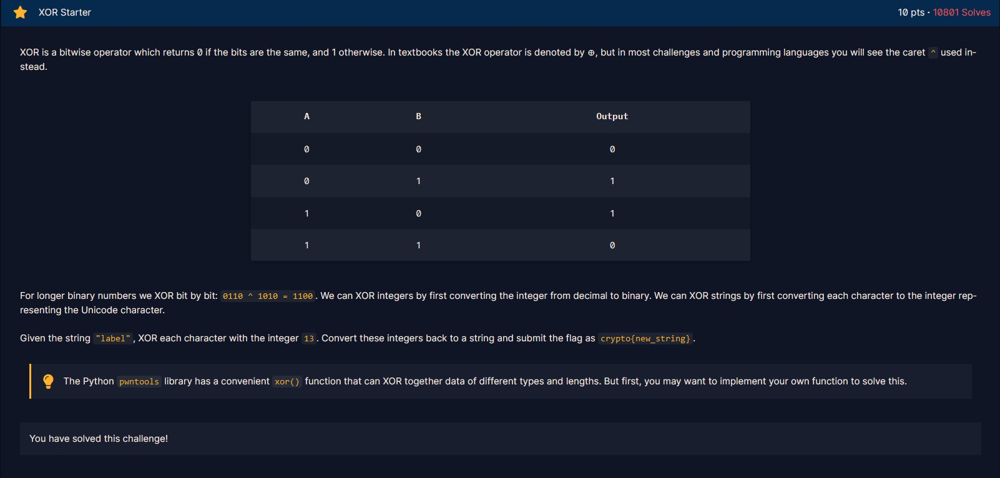
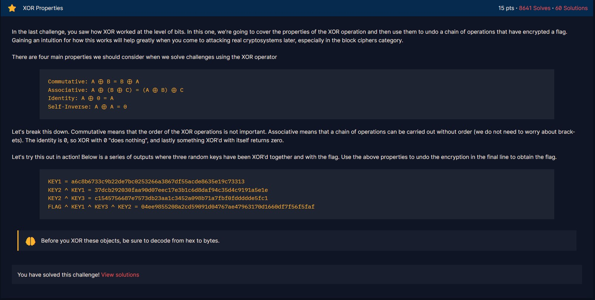
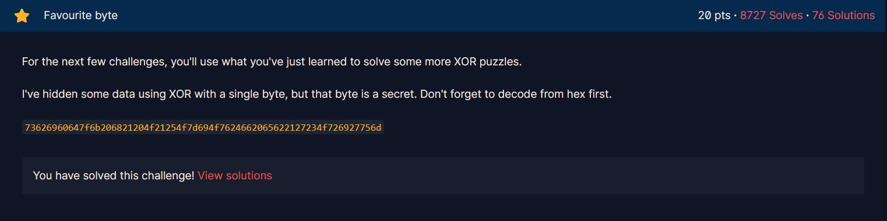
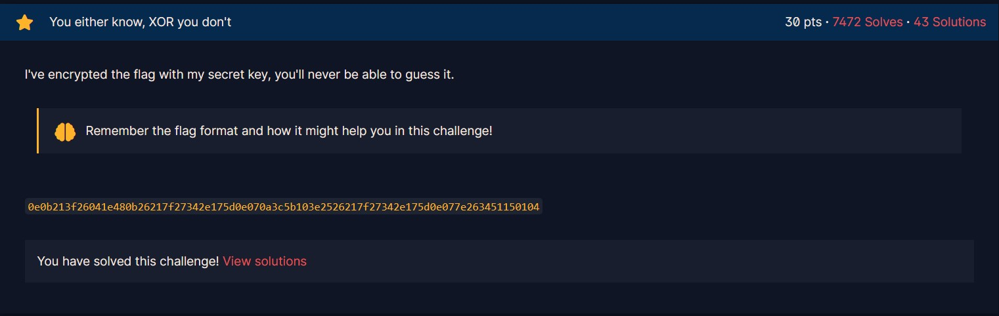

# Xor Starter



Đề bài yêu cầu ta tính `"label" ^ 13`. Để XOR chuỗi kí tự A với một số nguyên B thì ta lấy mã ASCII của từng kí tự của chuỗi A đem XOR với B, sau đó chuyển về lại kí tự rồi ghép lại với nhau.

```py
print(''.join([chr(ord(i) ^ 13) for i in "label"]))
```

Kết quả: 
```
aloha
```

Flag:
```
crypto{aloha}
```

# Xor Properties



Bài này chủ yếu nói về các tính chất của phép XOR.

```py
# NHIỆM VỤ: TÌM FLAG BIẾT

A = KEY1 = bytes.fromhex("a6c8b6733c9b22de7bc0253266a3867df55acde8635e19c73313")
B = KEY2 ^ KEY1 = bytes.fromhex("37dcb292030faa90d07eec17e3b1c6d8daf94c35d4c9191a5e1e")
C = KEY2 ^ KEY3 = bytes.fromhex("c1545756687e7573db23aa1c3452a098b71a7fbf0fddddde5fc1")
D = FLAG ^ KEY1 ^ KEY3 ^ KEY2 = bytes.fromhex("04ee9855208a2cd59091d04767ae47963170d1660df7f56f5faf")
```

Lời giải:

```
* KEY2 = KEY2 ^ 0 = KEY2 ^ (KEY1 ^ KEY1) = (KEY2 ^ KEY1) ^ KEY1 = B ^ A

* KEY3 = KEY3 ^ 0 = KEY3 ^ (KEY2 ^ KEY2) = (KEY3 ^ KEY2) ^ KEY2 = (KEY2 ^ KEY3) ^ KEY2 = C ^ KEY2

* FLAG = FLAG ^ 0 ^ 0 ^ 0 = FLAG ^ (KEY1 ^ KEY1) ^ (KEY2 ^ KEY2) ^ (KEY3 ^ KEY3) = (FLAG ^ KEY1 ^ KEY2 ^ KEY3) ^ KEY1 ^ KEY2 ^ KEY3 = D ^ KEY1 ^ KEY2 ^ KEY3
```

```py
A = bytes.fromhex("a6c8b6733c9b22de7bc0253266a3867df55acde8635e19c73313")
B = bytes.fromhex("37dcb292030faa90d07eec17e3b1c6d8daf94c35d4c9191a5e1e")
C = bytes.fromhex("c1545756687e7573db23aa1c3452a098b71a7fbf0fddddde5fc1")
D = bytes.fromhex("04ee9855208a2cd59091d04767ae47963170d1660df7f56f5faf")

def xor(a,b):
    return b''.join([(i ^ j).to_bytes(1, 'big') for i, j in zip(a, b)])

KEY2 = xor(B, A)
KEY3 = xor(C, KEY2)
FLAG = xor(xor(xor(D, A), KEY2), KEY3)
print(FLAG)
```

Flag:
```
b'crypto{x0r_i5_ass0c1at1v3}'
```

# Favourite byte



Vì `secret` chỉ có giá trị từ 0 tới 255 nên ta sẽ bruteforce để tìm kết quả.

```py
for secret in range(0, 256):
    t = ''.join([chr(secret ^ i) for i in bytes.fromhex("73626960647f6b206821204f21254f7d694f7624662065622127234f726927756d")])
    if ('crypto' in t): # The flag format is crypto{FLAG}, so we can use this to limit the answer
        print(t)
```

Flag:
```
crypto{0x10_15_my_f4v0ur173_by7e}
```

# You either know, XOR don't



Ở challenge này đề bài đưa ra một chuỗi hex được mã hóa bằng cách XOR với một chuỗi `secret` không biết trước.

Tóm tắt:
```
encrypted_message = message ^ key
```

Trong đó:
* `encrypted_message = bytes.fromhex('0e0b213f26041e480b26217f27342e175d0e070a3c5b103e2526217f27342e175d0e077e263451150104')`

Vì flag có dạng `crypto{...}` nên ta có thể biết được một phần của key.

```py
encrypted_message = bytes.fromhex('0e0b213f26041e480b26217f27342e175d0e070a3c5b103e2526217f27342e175d0e077e263451150104')

print(chr(encrypted_message[0] ^ ord('c')), end='')
print(chr(encrypted_message[1] ^ ord('r')), end='')
print(chr(encrypted_message[2] ^ ord('y')), end='')
print(chr(encrypted_message[3] ^ ord('p')), end='')
print(chr(encrypted_message[4] ^ ord('t')), end='')
print(chr(encrypted_message[5] ^ ord('o')), end='')
print(chr(encrypted_message[6] ^ ord('{')), end='')
print(chr(encrypted_message[-1] ^ ord('}')), end='')
```

Kết quả:
```
myXORkey
```

Có vẻ đây chính là `key` bị giấu. Ta có thể dễ dàng tìm được `message` (chính là flag).

```py
encrypted_message = bytes.fromhex('0e0b213f26041e480b26217f27342e175d0e070a3c5b103e2526217f27342e175d0e077e263451150104')

key = b'myXORkey'

for i in range(len(encrypted_message)):
    print(chr(encrypted_message[i] ^ key[i % len(key)]), end='')
```

Flag:
```
crypto{1f_y0u_Kn0w_En0uGH_y0u_Kn0w_1t_4ll
```

# Lemur XOR