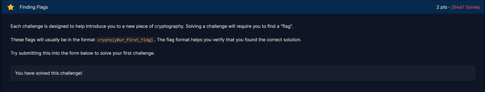
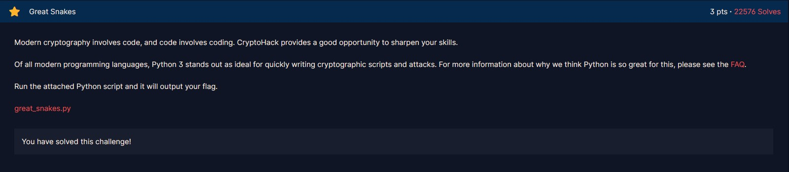
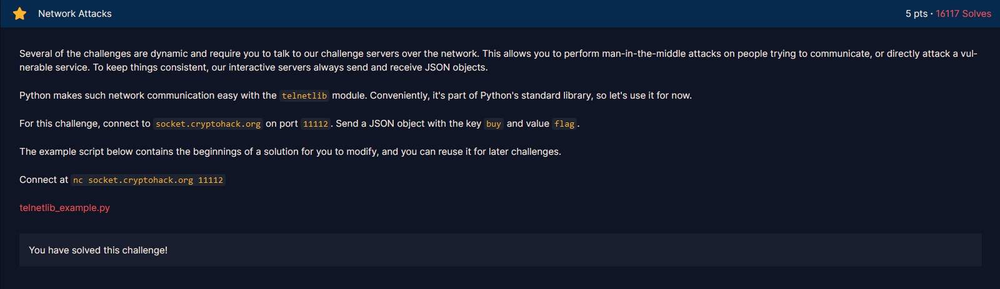

# Finding Flags



Flag của hầu hết challenge sẽ có dạng `crypto{y0ur_f1rst_fl4g}`.

Và flag của bài này cũng vậy :D
```
crypto{y0ur_f1rst_fl4g}
```

# Great Snakes



Học crypto mà cũng cần lập trình á?


Để làm quen đề bài yêu cầu ta build và run file python
```bash
python3 great_snakes_35381fca29d68d8f3f25c9fa0a9026fb.py
```

Kết quả:
```
Here is your flag:
crypto{z3n_0f_pyth0n}
```

# Network Attacks



Challenge giới thiệu cho ta về cách kết nối tới server bằng socket/nc.

Ta dùng nc để connect tới server bằng bash:
```bash
nc socket.cryptohack.org 11112
```

Sau đó nhập json như đề bài yêu cầu:
```json
{"buy":"flag"}
```

Và nhận được flag:
```json
{"flag": "crypto{sh0pp1ng_f0r_fl4g5}"}
```